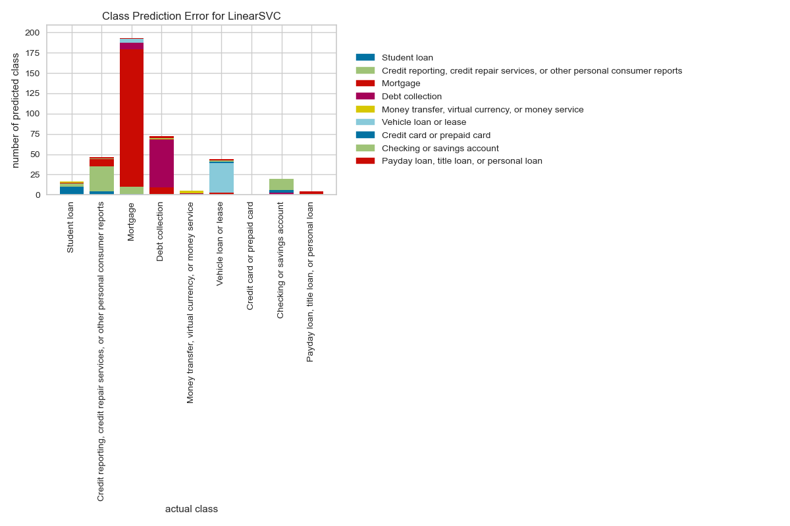

# Background of the Data
* Data Source: https://catalog.data.gov/dataset/consumer-complaint-database
The dataset is obtained from the public data from data.gov website under the domain `consumer-complaint-database`. The Consumer Complaint Database is a collection of complaints about consumer financial products and services that we sent to companies for response. The database generally updates daily. So, each day when we download the dataset, it may be larger than the previous dataset.

The dataset has above 1 million rows and 18 columns out of which, for the text data category classification, we are only interested in two features: `Product` and `Consumer complaint narrative`.

# Business Problem
This project aims to accurately classify the Product category of the complaint. There are more than 10 categories of the product such as `Mortgage`, `Debt collection` and so on. Our aim is to read the text 
complaint and classify as on of these category.

**NOTE**:    
Originally there are more than 10 categories in original database, but some of the categories are
ambiguous, such as there are three different categories `Credit card`, `Prepaid card`, and `Credit card or prepaid card`. If we have a given complaint about credit card, what should it be classified as? `Credit card` or `Credit card and prepaid card` ? To avoid this problem the ambiguous categories are merged into one single categories and finally we have only 10 different categories.
For a sample of 2,000 data, the category distribution looks like this:


# Text Data Cleaning
Usually the written text is full of informal language and requires cleaning the text before we proceed with
analyzing the text. For example, we need to remove the STOPWORDS and expand the contractions.
Data cleaning strategy:
1. split combined text: `areYou` ==> `are You`
2. lowercase: `You` ==> `you`
3. expand apostrophes: `you're` ==> `you are`
4. remove punctuation: `hi !` ==> `hi`
5. remove digits: `gr8` ==> `gr`
6. remove repeated substring: `ha ha` ==> `ha`
7. remove stop words: `I am good` ==> `good`
8. lemmatize: `apples` ==> `apple`

# Tf-idf
For the text processing tasks (NLP), we usually use a method called `Term Frequency - Inverse Document Frequency`.

**Term Frequency** : This gives how often a given word appears within a document.

$\mathrm{TF}=\frac{\text { Number of times the term appears in the doc }}{\text { Total number of words in the doc }}$

**Inverse Document Frequency**: This gives how often the word appers across the documents.
If a term is very common among documents (e.g., “the”, “a”, “is”),
then we have low IDF score.

$\mathrm{IDF}=\ln \left(\frac{\text { Number of docs }}{\text { Number docs the term appears in }}\right)$

**Term Frequency – Inverse Document Frequency TF-IDF**: 
TF-IDF is the product of the TF and IDF scores of the term.

$\mathrm{TF}-\mathrm{IDF}=\frac{\mathrm{TF}}{\mathrm{IDF}}$

# Top N correlated terms per category
We can use scikitlearn text vectorizer class `sklearn.feature_extraction.text.TfidfVectorizer` to get
the vectorized form of given text data. Then using feature selection (`sklearn.feature_selection.chi2`) we get
following top most unigrams and bigrams for each categories:


# Modelling Text data
We can process the raw text data in machine learning libraries. So we first clean the data and then use
`TfidfVectorizer` to get vectorized data from text data. Here we allocate 25% of the data for the test and 75% of the data for the training purposes. We look at various machine learning models and assess the accuracies. Out of those models tested, support vector machine stood on top of others and presented the highest accuracy.


After hyperparameter tuning for the Linear SVC, I got higher accuracy of 0.7222.

# Model Evaluation




# Big Data Analysis
Here we so far we have used only the portion of the data (2,000 samples out of million samples) and used
scikit-learn models. But for real world data we may need to use all data for better performances. For large
data pandas can not handle the data and the program crashes. So, we need to use big data architectures such as
Amazon AWS or IMB Watson so on, where we can use pandas by assigning larger RAM and CPU. However, we can also use distributed modules such as dask or pyspark. Here, I have used pyspark since it scales upto hundreds of GB of data and can be run in single node or personal computer.

**NOTE**:  
Pyspark is an immature library. It was borrowed from scala and many functionalities are still need to be implemented. For example, while reading the `complaints.csv` file, using pandas we can simply use `pd.read_csv`, however, pyspark is not sophisticated enough to read the csv file automatically when it has multiline. To cirumvent these obstacles we can use spark read option with `multiLine=True, escape='"'`.

## Modelling Pipeline
For text data processing using pyspark, here I have used following pipelines:
```python
from pyspark.ml.feature import Tokenizer,StopWordsRemover,HashingTF,IDF

tokenizer = Tokenizer().setInputCol("complaint").setOutputCol("words")
remover= StopWordsRemover().setInputCol("words").setOutputCol("filtered").setCaseSensitive(False)
hashingTF = HashingTF().setNumFeatures(1000).setInputCol("filtered").setOutputCol("rawFeatures")
idf = IDF().setInputCol("rawFeatures").setOutputCol("features").setMinDocFreq(0)
```

For the logistic regression
