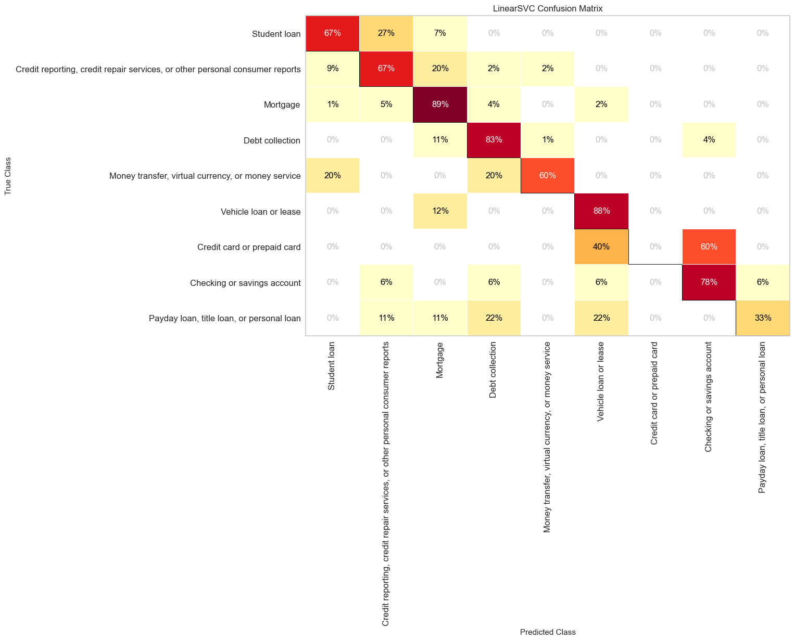
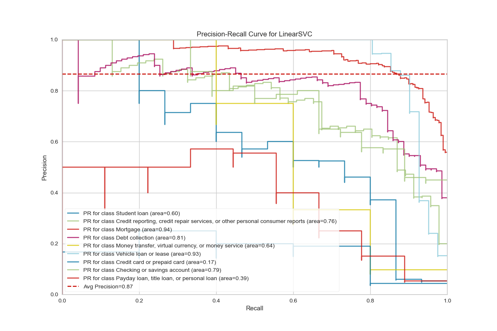

<h1 style="background-color:tomato;">Background of the Data</h1>

- Data Source: https://catalog.data.gov/dataset/consumer-complaint-database

The dataset is obtained from the public data from data.gov website under the domain `consumer-complaint-database`. The Consumer Complaint Database is a collection of complaints about consumer financial products and services that we sent to companies for response. The database generally updates daily. So, each day when we download the dataset, it may be larger than the previous dataset.

The dataset has above 1 million rows and 18 columns out of which, for the text data category classification, we are only interested in two features: `Product` and `Consumer complaint narrative`.


<h1 style="background-color:tomato;">Business Problem</h1>

This project aims to accurately classify the Product category of the complaint. There are more than 10 categories of the product such as `Mortgage`, `Debt collection` and so on. Our aim is to read the text complaint and classify as on of these category.

<p style="color:green;">NOTE</p>

Originally there are more than 10 categories in original database, but some of the categories are
ambiguous, such as there are three different categories `Credit card`, `Prepaid card`, and `Credit card or prepaid card`. If we have a given complaint about credit card, what should it be classified as? `Credit card` or `Credit card and prepaid card` ? To avoid this problem the ambiguous categories are merged into one single categories and finally we have only 10 different categories.
For a sample of 2,000 data, the category distribution looks like this:


<h1 style="background-color:tomato;">Text Data Cleaning</h1>

Usually the written text is full of informal language and requires cleaning the text before we proceed with
analyzing the text. For example, we need to remove the STOPWORDS and expand the contractions.
Data cleaning strategy:
1. split combined text: `areYou` ==> `are You`
1. lowercase: `You` ==> `you`
1. expand apostrophes: `you're` ==> `you are`
1. remove punctuation: `hi !` ==> `hi`
1. remove digits: `gr8` ==> `gr`
1. remove repeated substring: `ha ha` ==> `ha`
1. remove stop words: `I am good` ==> `good`
1. lemmatize: `apples` ==> `apple`


<h1 style="background-color:tomato;">Tf-idf:</h1>

For the text processing tasks (NLP), we usually use a method called `Term Frequency - Inverse Document Frequency`.

<p style="color:green;">Term Frequency:</p>

This gives how often a given word appears within a document.

```

TF = Number of times the term appears in the doc
     ----------------------------------------------
	 Total number of words in the doc

```


<p style="color:green;">Inverse Document Frequency:</p>

This gives how often the word appers across the documents.
If a term is very common among documents (e.g.,`the`, `a`, `is`),
then we have low IDF score.

```
            Number of docs
DF = ln (  --------------------------------)
		    Number docs the term appears in
```

<p style="color:green;">Term Frequency – Inverse Document Frequency TF-IDF:</p>

TF-IDF is the product of the TF and IDF scores of the term.

```
           TF
TF-IDF = ------
           DF
```

<h1 style="background-color:tomato;">Top N correlated terms per category</h1>

We can use scikitlearn text vectorizer class `sklearn.feature_extraction.text.TfidfVectorizer` to get
the vectorized form of given text data. Then using feature selection (`sklearn.feature_selection.chi2`) we get
following top most unigrams and bigrams for each categories:


<h1 style="background-color:tomato;">Modelling Text data</h1>

We can not use the raw text data as the input for scikit-learn classifiers.
We first need to vectorize them and convert the words to number. Here, in this
project I have used the Tf-idf vectorizer with ngram of (1,2) and tried varios
classifiers. Among many classifiers, I found svm.LinearSVC gave me the best accuracy.
For the 2019 data with sampling of 2000 samples with random seed of 100, I got the
accuracy of 0.8125 for the test data. For the full data of 2019 (124,907 almost 125k)
after splitting train-test as 80%-20%, I got the accuracy of 0.8068.

<h1 style="background-color:tomato;">Model Evaluation</h1>







<h1 style="background-color:tomato;">Big Data Analysis</h1>

Here, we have so far used only the portion of the data (2,000 samples out of million samples) and used scikit-learn models. But for real world data we may need to use all data for better performances. For large
data pandas can not handle the data and the program crashes. So, we need to use the big data architectures such as
Amazon AWS or IMB Watson so on, where we can use pandas by assigning larger RAM and CPU. However, we can also use the open source free modules such as dask or pyspark which can scale upto multiple gigabytes of data. Here, I have used pyspark which can be both used in laptop and also in Amazon AWS servers.

<p style="color:green;">NOTE:</p>

Pyspark is an immature library. It was borrowed from scala and many functionalities are still need to be implemented. For example, while reading the `complaints.csv` file, using pandas we can simply use `pd.read_csv`, however, pyspark is not sophisticated enough to read the csv file automatically when it has multiline. To cirumvent these obstacles we can use spark read option with `multiLine=True, escape='"'`.


<h1 style="background-color:tomato;">Modelling Pipeline</h1>

For text data processing using pyspark, here I have used following pipelines:
```python
from pyspark.ml.feature import Tokenizer,StopWordsRemover,HashingTF,IDF

tokenizer = Tokenizer().setInputCol("complaint").setOutputCol("words")
remover= StopWordsRemover().setInputCol("words").setOutputCol("filtered").setCaseSensitive(False)
hashingTF = HashingTF().setNumFeatures(1000).setInputCol("filtered").setOutputCol("rawFeatures")
idf = IDF().setInputCol("rawFeatures").setOutputCol("features").setMinDocFreq(0)
```
